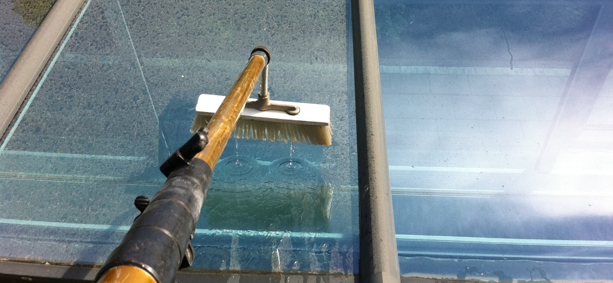
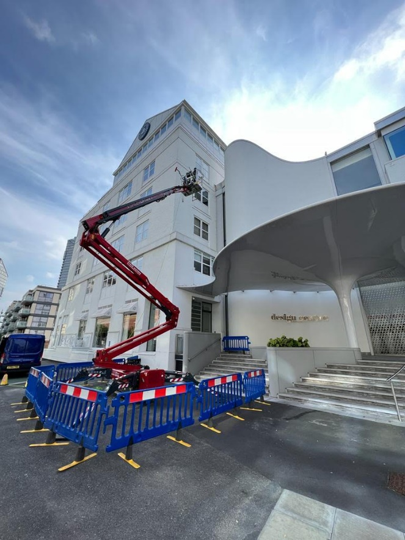
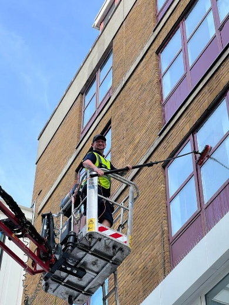
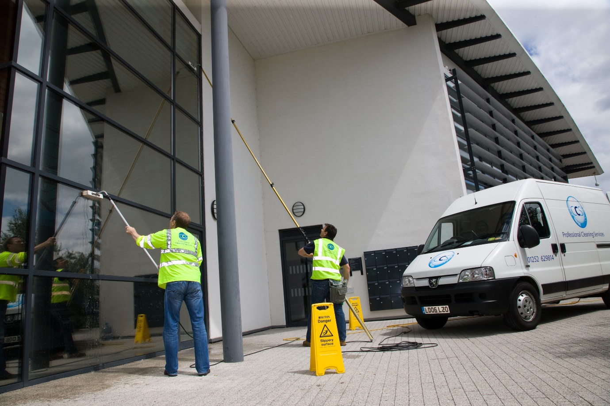
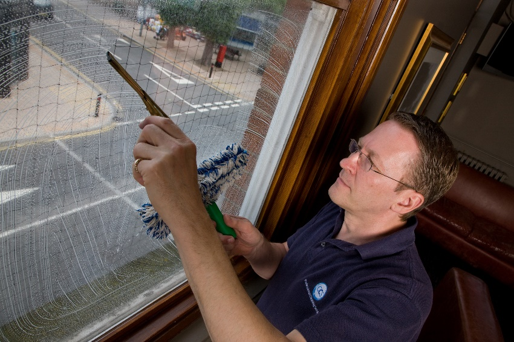
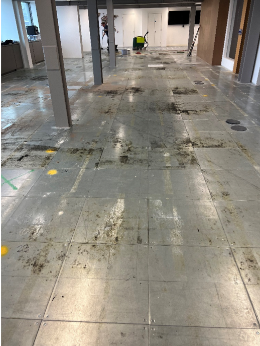
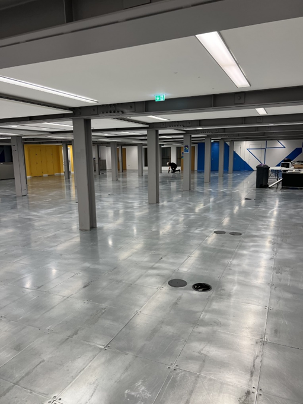
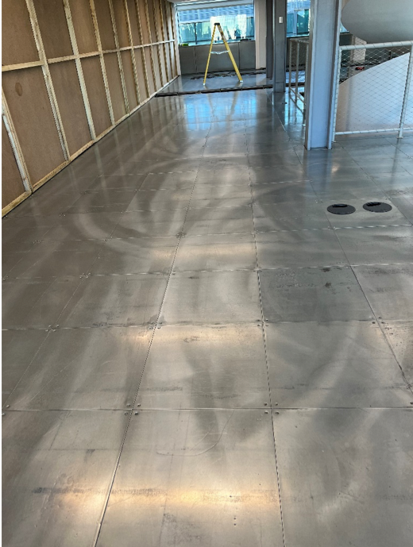
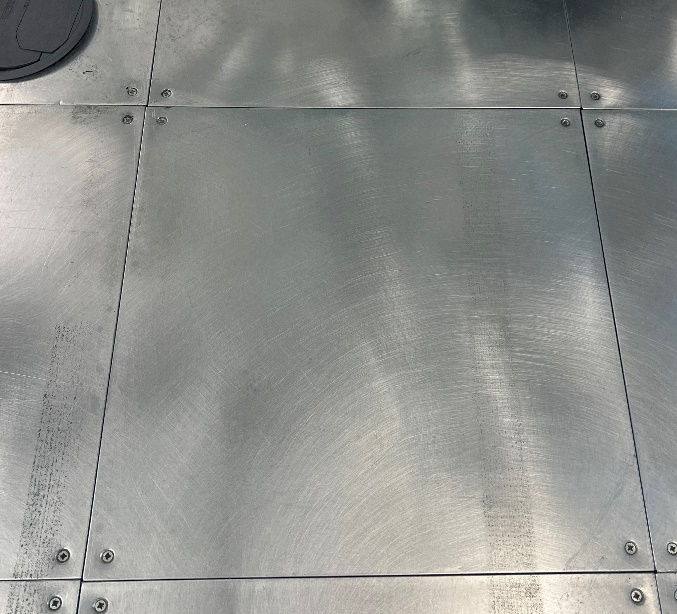

Your reliable cleaning and support services partner.

## Retail, commercial and specialist cleaning services

- Window cleaning
- After builders clean
- Office clean
- High level cleaning
- Doff cleaning
- Communal cleaning
- Floor cleaning
- Industrial cleaning
- Carpet cleaning
- Cladding cleaning
- End of let cleaning
- Deep clean

### Why Clearview Cleaning Solutions?

If you are looking for an exceptional reliable cleaning and support services partner, we are the contractor of choice.

With a proven track record spanning over 18 years, CCS has built an unrivalled reputation for service and delivery and our unique working philosophy ensures that our working practices set the benchmark in the cleaning sector.

## Window cleaning

Clearview Cleaning Solutions Ltd offer a regular window cleaning service to homes and commercial properties across London and the home counties.  Our staff treat all customers with the utmost care and professionalism you would expect from skilled tradesmen.

We use the latest equipment to help our staff clean all those hard-to-reach windows and frames offering our customers complete satisfaction with our service guaranteed.

As windows cleaners we fully understand the importance of ensuring your windows are cleaned to a very high standard leaving your glass spotlessly clean.

We service all types of commercial and industrial clients, these currently include Local housing associations, Shopping Centres, Office Blocks, Hotels, Letting Companies, Residential Living and Care Homes.

- High Level Window Cleaning
- High Level Gutter Cleaning
- Water Fed Pole Window Cleaning
- Commercial Pressure Washing
- Commercial Cladding Cleaning
- MEWP Access Platforms and Tracked Cherry Pickers

Health & Safety is also major consideration for us, from personal protective equipment, warning signs and the safe working conditions.   All our staff also undertake health and safety level 1 certificates, CITB and IPAF training.

Before we start any window cleaning work on your premises, we carry out a Dynamic Risk Assessment taking into consideration all the relevant working conditions, various appropriate types of access, any work at height requirements, necessary equipment, and other appropriate considerations.   All staff will be briefed on the risks and methods involved signing the documents to say they fully understand what’s required. We are fully insured to protect you and your premises as well as ourselves.

## Carpet glue removal

Carpet Glue removal – Here at Clearview we have developed a way of removing all the glue tackifier residue left from on the metal raised flooring. After removing the old carpet tiles, we are always left with the glue residue.  We want to encourage landlords to reuse their old, raised flooring instead of replacing and sending to land fill.  Instead of replacing them and throwing away your old ones, make the decision to clean and reuse, so many times we see companies replacing them for brand new tiles only for the new tenants to come in and cover them in carpet.

Cost Advantage - the cost saving compared to relacing could be as much as 50%, not to mention the huge carbon saving. Polished floors can improve the attractiveness of the office space offering light and style to an office space to prospective clients.

Urban Chic – Certainly, metal is not the first thing you think of when you think of floor tiles. But more widely it is being used in offices and left completely bare without carpet. The recycled metal, as well as being eco- friendly provides a host of practical benefits and gives the office its own unique style. 

Environmentally friendly - If your keen to be environmentally friendly and re- use your flooring whilst making you a big saving reuse raised flooring rather than it is entering into landfill.

Time Saving - Construction companies are often restricted on time during fit-outs, by cleaning the tiles and not replacing we can save them valuable time to complete other tasks ready for handover.

